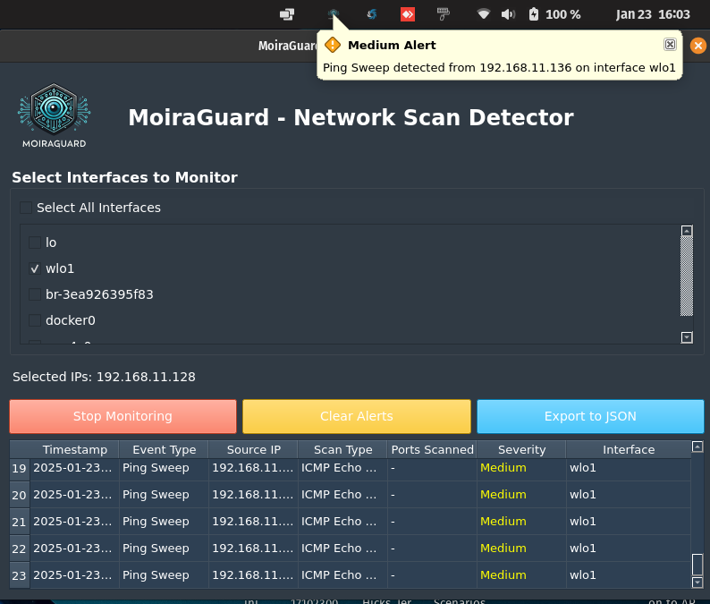

# MOIRAGUARD-NSD 
## A Network security tool detect and alert users to potential network scanning activities in real-time.

### Screenshots

#### Main Interface:



# Getting Started with MoiraGuard-NSD Using Docker

Follow these steps to run MoiraGuard from Docker Hub:

---
## 0. TL;DR 

You can change where the alert logs will be saved by changing /var/log in the command below. Replace /var/log with your desired directory path.

Usage: Run the MOIRAGUARD-NSD tool, choose an interface to monitor, and close the interface—it will continue running in the background. :)

```bash
xhost +local:docker && \
sudo docker run -it --rm \
  -e DISPLAY=$DISPLAY \
  -v /tmp/.X11-unix:/tmp/.X11-unix \
  -v /var/log:/app/logs \  # Change /var/log to your desired directory
  --network=host \
  --cap-add=NET_RAW --cap-add=NET_ADMIN \
  moiraguard/moiraguard-nsd:v2
```
---

## 1. Prerequisites

Ensure that Docker is installed on your system. If not, you can follow the [Docker installation guide](https://docs.docker.com/get-docker/) for your operating system.

---

## 2. Pull the MoiraGuard Image from Docker Hub

To pull the pre-built MoiraGuard image from Docker Hub, run the following command:

```bash
sudo docker pull moiraguard/moiraguard-nsd:v2
```
---
## 3. Run the Docker Container (Foreground Mode)

To run the container interactively in the foreground, execute:

```bash
sudo docker run -it --rm \
  -e DISPLAY=$DISPLAY \
  -v /tmp/.X11-unix:/tmp/.X11-unix \
  -v /var/log:/app/logs \  # Change /var/log to your desired directory
  --network=host \
  --cap-add=NET_RAW --cap-add=NET_ADMIN \
  moiraguard/moiraguard-nsd:v2

```
---
## 4. Run the Docker Container (Background Mode)

To run the container in the background (detached mode), add the -d flag:
```bash
sudo docker run -d \
  -e DISPLAY=$DISPLAY \
  -v /tmp/.X11-unix:/tmp/.X11-unix \
  -v /var/log:/app/logs \  # Change /var/log to your desired directory
  --network=host \
  --cap-add=NET_RAW --cap-add=NET_ADMIN \
  --name moiraguard-container \
  moiraguard/moiraguard-nsd:v2
```
---
Explanation of Flags:

    -d: Runs the container in detached mode.

    --name moiraguard-container: Assigns a specific name to the container for easy reference.
    
    -v /var/log:/app/logs: Maps the /var/log directory on your host to /app/logs in the container. Replace /var/log with your desired directory to save alert logs.

You can check if the container is running using:

```bash
sudo docker ps
```

To stop the container later, run:
```bash
sudo docker stop moiraguard-container
```
---
## 5. Set the DISPLAY Variable Properly (if faced issues related to Display)

If you encounter the issue where the error message states that the Qt platform plugin "xcb" could not connect to the X11 display, it is likely because the Docker container is trying to access your graphical environment but fails due to missing permissions or improper configuration.

If the graphical interface does not work immediately, try setting the DISPLAY variable as follows:

```bash
export DISPLAY=:0
```

Also Allow Docker to Access the X11 Display 
In some systems, you need to explicitly allow Docker containers to access the X11 display. Run the following command on your host machine:

```bash
xhost +local:docker
```
---
## 6. Monitor Alerts

Once the container is running, Chose interface you want to monitor then MoiraGuard-NSD will  begin monitoring network scanning activities. Alerts will appear via desktop notifications and in the system tray.

---
## 7. Export Logs and Analyze Data

MoiraGuard-NSD logs scanning activities, which can be exported in JSON format for further analysis or integration with other security tools.

---
## 8. Stop the MOIRAGUAR-NSD Container


    If you are running in the foreground mode, press Ctrl + C in the terminal to stop the container.

    If running in background mode, stop the container with:

```bash
sudo docker stop moiraguard-container
```
---

## New Features and Improvements


1. Improved Interface Selection

    Added a scrollable list of checkboxes for selecting multiple interfaces.

    Included a "Select All Interfaces" checkbox to quickly select or deselect all interfaces.

    Display the IP addresses of the selected interfaces for clarity.

2. Thread Management and Fallback Mechanism

    Implemented a graceful shutdown for monitoring threads.

    Added a fallback mechanism to forcefully terminate unresponsive threads after a timeout.

    Improved error handling to prevent the tool from freezing when dealing with problematic interfaces (e.g., Docker).

3. User-Friendly UI Enhancements

    Disabled buttons during critical operations (e.g., starting/stopping monitoring) to prevent user interference.

    Added a loading indicator (e.g., "Starting monitoring..." or "Stopping monitoring...") to provide feedback during operations.

    Ensured the GUI remains responsive even during thread termination.

4. Custom Log Directory

    Users can specify where to save alert logs by changing the directory in the -v flag when running the Docker container. For example:


```bash
-v /path/to/your/logs:/app/logs
```

## Troubleshooting

Issue: GUI Does Not Launch

    Ensure that the DISPLAY variable is set correctly and that Docker has access to the X11 display.

    Run the following commands on your host machine:

```bash
export DISPLAY=:0
xhost +local:docker
```

Issue: Tool Freezes When Stopping Monitoring

    The tool now includes a fallback mechanism to forcefully terminate unresponsive threads. If the issue persists, restart the container.

## License

MoiraGuard-NSD is licensed under the GNU Affero General Public License (AGPL).

**Note**: Commercial use of this software is prohibited without explicit permission from the author.

## Contributing

Contributions are welcome! Please open an issue or submit a pull request if you have any improvements or bug fixes.

## One more thing :)

Enjoy using MoiraGuard-NSD! If you have any questions or feedback, feel free to reach out. 🚀